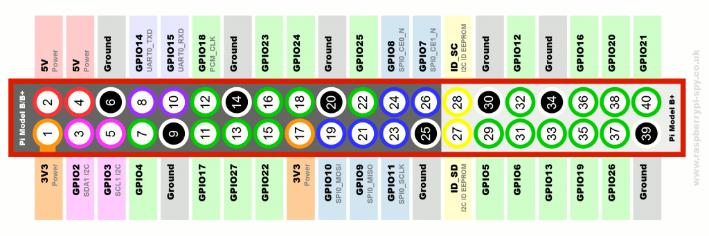
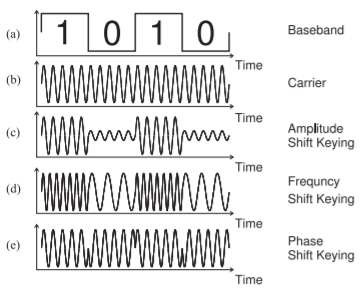
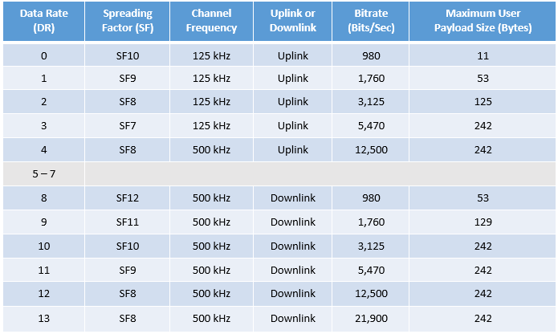
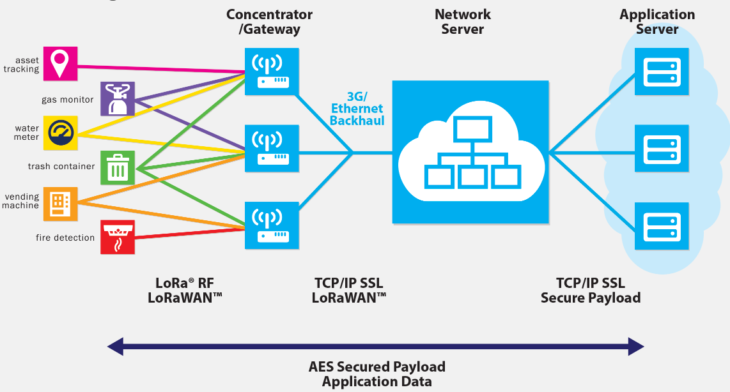
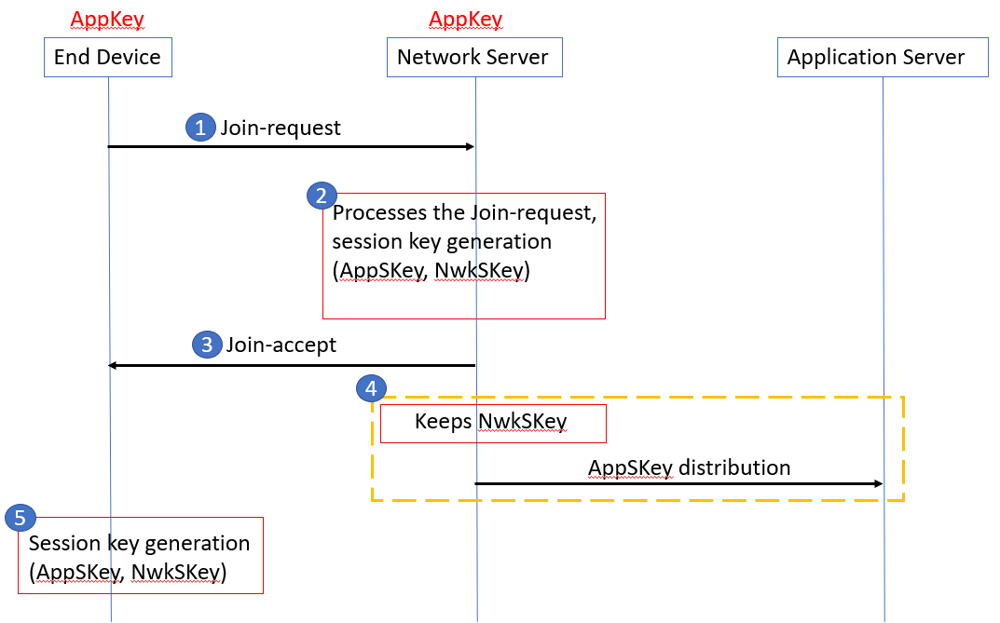
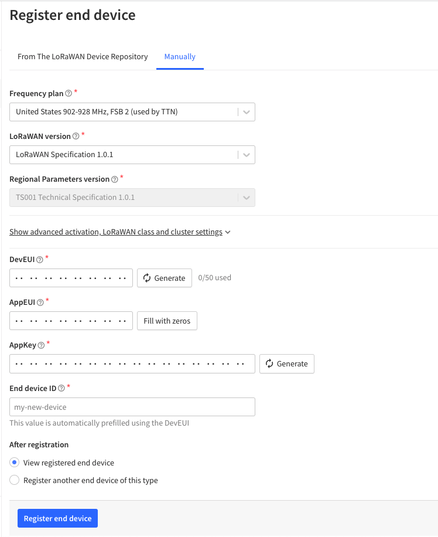
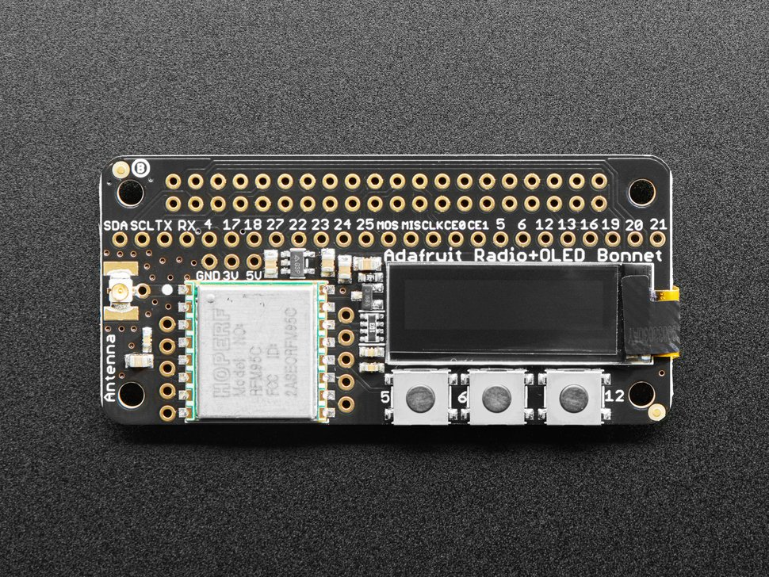
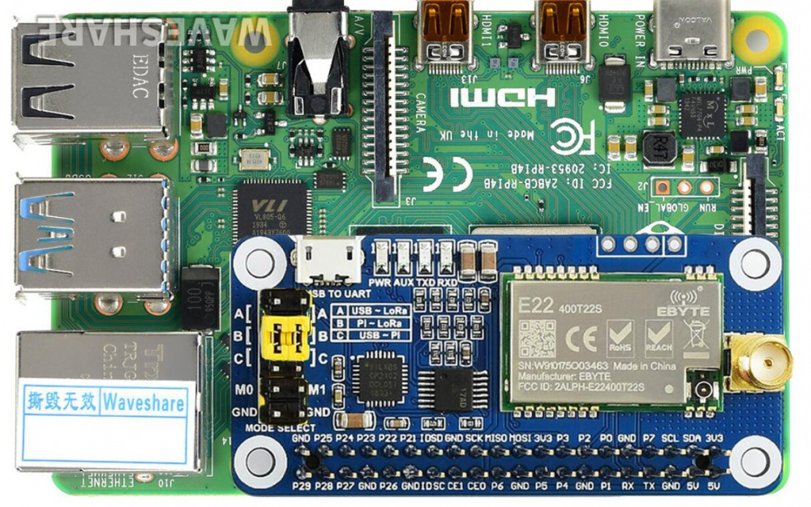

# DFW Pythoneers Talk on LoRa & LoRaWAN
 

GitHub LoRa repo:

https://github.com/Lora-net

  

https://lora-alliance.org/about-lorawan/


## Technical Terms:

* **RPi** - shorthand for Raspberry Pi


* **GPIO.BCM** Broadcom chip-specific pin numbers. These pin numbers follow the lower-level numbering system defined by
  the Raspberry Pi's Broadcom-chip brain.
  * If you want to refer to the pins with the numbers represented in circles (i.e 1, 2, 3, …) then you would be referring
    them with the GPIO.BOARD method.

  * But, if you want to refer the pins with the numbers represented in the rectangles around the pins (i.e GPIO 21,
    GPIO 25, …) then in that case you would be referring to GPIO.BCM method

Example:
  

* **Transceiver** - combination of a transmitter/receiver in a single device. Most
  LoRa end nodes and gateways are transceivers i.e. able to both transmit and receive data


* **Modulation** - how analog or digital information is encoded onto a carrier signal
  * Analog:  
    * Amplitude Modulation (AM)
    * Frequency Modulation (FM)
    * Phase Modulation (PM)
  * Digital:
    * Amplitude Shift Keying (ASK)
    * Frequency Shift Keying (FSK)
    * Phase Shift Keying (PSK)
      
  


  Source: https://eng.libretexts.org/Bookshelves/Electrical_Engineering/Electronics/Microwave_and_RF_Design_I_-_Radio_Systems_(Steer)/02%3A_Modulation/2.05%3A_Digital_Modulation


* **I2C** - Synchronous Multi-controller/Multi-target Serial Communication Bus
  * The I2C protocol is used to establish communication between two or more IC's (Integrated Circuits)


* **SPI** - Serial Peripheral Interface
  * is a synchronous serial communication or protocol normally found on RPi for two devices to send and receive data
  * I2C on the other hand share a single data wire
  
  Source: https://learn.adafruit.com/circuitpython-basics-i2c-and-spi/spi-devices?gclid=CjwKCAjwsJ6TBhAIEiwAfl4TWIzVniDvAVgEOLEkvDarvc1BUPUY0CubcazydnU9LvjP4zbjciRJyhoCjtkQAvD_BwE
    
    
* The **baud rate** is the rate at which information is transferred in a communication channel. It is commonly used
  when discussing electronics that use serial communication. In the serial port context, "9600 baud" means that the
  serial port is capable of transferring a maximum of *9600 bits per second*.
  
  

  
## What is LoRa?
* LoRa technology is used as wide area network wireless technology. 


* It is a great technology for IoT devices since its architecture is designed for very little power consumption
  (some devices last 10 years on a single battery) and for long ranges several miles.
  
  - Transmission in general of as far as 15 km (9 mi) with clear line of sight or in urban areas is 2 to 3 km (~1+ mi)
   
  - Bluetooth is only good for 30 feet (10 meters) in comparison  


* There are different frequency bands:
  
    - US: (902 to 928 MHz)
    - EU: (863 to 870 MHz)
    - China: (779 to 787 MHz)
    - India 3 channels: (865.0625 MHz, 865.4025 MHz, 865.9850 MHz)
    - Australia: (915 to 928 MHz)
    - Other Asian countries: (920 to 923 MHz or 923 to 925 MHz)
  
    Source: https://devopedia.org/lora


* LoRa is based on Chirp Spread Spectrum (CSS) technology, where chirps (also known as symbols) are the carrier of data.
  The LoRa spread spectrum modulation technique is patented by [Semtech](https://www.semtech.com/)
  

  Source: https://www.thethingsnetwork.org/docs/lorawan/spreading-factors/#:~:text=LoRa%20is%20based%20on%20Chirp,the%20speed%20of%20data%20transmission.
  

* Spreading Factors and Frequencies

  Source: Semtech Corporation 2020


* The transmission from end device to gateway is referred as "uplink." 
    

* Transmission from gateway to end device is referred as "downlink"


### Device Classes
* **Class A:** devices sleep most of the time. They listen for downlink messages (from gateway to device) only for a short period after transmitting. If a cloud-hosted application sends a command to this device, a significant delay may take place until the messages is received by the device. Because of that, class A devices are typically battery-powered sensors, having a battery time of up to 10 years.
  

* **Class B:** devices can receive downlink messages in scheduled downlink slots. These devices are typically battery-powered actuators.
  

* **Class C:** almost never sleep and continuously listen for the incoming messages. If a cloud-hosted application sends a command to this device, the message will reach the devices with a low delay. Because of that, these devices are typically mains-powered actuators.

## What is LoRaWAN ?

LoRa  & LoRaWAN Topology




There are two protocols:


* **OTAA** Over-The-Air-Activation
  - The most secure and recommended activation method for end devices. Devices perform a join procedure with the network, during which a dynamic device address is assigned and security keys are negotiated with the device.


* **ABP** Activation By Personalization
  - It requires hardcoding the device address as well as the security keys in the device. ABP is less secure than OTAA and also has the downside that devices can not switch network providers without manually changing keys in the device.


### OTAA message flow in LoRaWAN 1.0


Source: https://www.thethingsnetwork.org/docs/lorawan/end-device-activation/


AppEUI - 8 bytes

DevEUI - 8 bytes

DevNonce - 2 bytes

### Adding devices to The Things Network (TTN)


1. First create a community account with TTN, it's free


2. Go to the Applications section and create some generic name
   - TTN will let you know if it is already used
  

3. Click on the `+ Add end device button` to get **DevEUI, AppEUI and AppKey**
   - You can try to find From The LoRaWAN Device Repository, I did not find raspberry pi in the device repository,
    here is how you do it manually:
   - Click on `Manually`
   - Frequency plan: United States 902-928 MHz, FSB2
   - LoRaWAN Specifications 1.0.1
   - DevEUI (click on Generate, let TTN to create this for you)
   - AppEUI (click fill with zeros)
   - AppKey (click on Generate, let TTN to create this for you)
   - End device ID (will be created by TTN, leave blank)
   - `Register end device`
    

Not yet completed (to be continued)...    
4. Send an Uplink Payload, special thanks to mobilefish.com - **Robert Lei**:
    
    - Inspiration: 
      
        https://www.youtube.com/watch?v=k5-1o8WifQM
    
    - Use a text to hexadecimal translator:

        https://www.rapidtables.com/convert/number/ascii-to-hex.html

  


## *Project Architecture:*


    source: https://www.techplayon.com/lora-technology-benefits-application/

<hr>

## Eric Livesay

*Data Engineer*
https://www.linkedin.com/in/ericlivesay

    Hardware: 
        1. Gowoops SX1276 LoRa Radio Wireless 915Mhz UART Serial Module
        2. Raspberry Pi Pico

    Project setup:

    The idea is to Setup Serial (UART) communications between two e32-915TDO lora modules. The example here is using Arduino,
    I plan on using two Raspberry Pi Pico's:
    
    https://osoyoo.com/2018/07/26/osoyoo-lora-tutorial-how-to-use-the-uart-lora-module-with-arduino/

<hr>

## Jack Camier 

*Full Stack Software Engineer, IoT Enthusiast*
https://www.linkedin.com/in/jacques-camier/


## Project setup: 
### Adafruit LoRa Radio Bonnet for Raspberry Pi

    Hardware: Adafruit LoRa Radio Bonnet with OLED - RFM95W @ 915MHz - RadioFruit

    * https://www.adafruit.com/product/4074



1. Configure I2C
  

`sudo apt-get install -y python-smbus`

`sudo apt-get install -y i2c-tools`

* sudo raspi-config
    * Interfacing Options or Advanced (Older versions)
    * then I2C and enable it
  

`sudo reboot`

`sudo ls /dev/i2c*`


2. Configure SPI


* sudo raspi-config
    * Interfacing Options or Advanced (Older versions)
    * then SPI and enable it
  

`sudo reboot`

`ls -l /dev/spidev*`

You should see two devices listed for each SPI bus

Now run this command:

`ls /dev/i2c* /dev/spi*`

You should see a response like this:

`/dev/i2c-1 /dev/spidev0.0 /dev/spidev0.1`

3. Install CircuitPython on RPi (requires Python 3.7 or later)

Source: https://learn.adafruit.com/circuitpython-on-raspberrypi-linux/installing-circuitpython-on-raspberry-pi
   

`sudo apt-get update`

`sudo apt-get upgrade`

`sudo apt-get install python3-pip`

`sudo pip3 install --upgrade setuptools`
  * setuptools is a package used by many other packages to handle their installation from source code. It is 
    used extensively for non-pure-Python packages, which need some compilation/installation step before being usable
    (like packages containing extensions written in C)

`cd ~`

`sudo pip3 install --upgrade adafruit-python-shell`

`wget https://raw.githubusercontent.com/adafruit/Raspberry-Pi-Installer-Scripts/master/raspi-blinka.py`

`sudo python3 raspi-blinka.py`
  * This will update your Raspberry OS to use Python3 as default
  * You really should as Python2 is now deprecated
  :smirk:

Yes to proceed, and yes to reboot

`sudo nano blinkatest.py`
  * copy over file blinkatest.py from repo

`python3 blinkatest.py`

You should see the following output if all things are working:

```
Hello blinka!
Digital IO ok!
I2C ok!
SPI ok!
done!
```

Next section...getting the Adafruit LoRa Radio Bonnet to work with RPi

Source: https://learn.adafruit.com/lora-and-lorawan-radio-for-raspberry-pi?view=all

`sudo pip3 install adafruit-circuitpython-ssd1306`

`sudo pip3 install adafruit-circuitpython-framebuf`

`sudo pip3 install adafruit-circuitpython-rfm9x`

You'll also want to download the font file, font5x8.bin

`wget https://github.com/adafruit/Adafruit_CircuitPython_framebuf/raw/main/examples/font5x8.bin`

`sudo nano rfm9x_check.py`
* copy over file rfm9x_check.py from repo

`python3 rfm9x_check.py`

If the RFM9x/RFM69 is detected, the OLED will display Detected!!!
:crossed_fingers:


* You can now press the buttons!!!
:star_struck:

`sudo nano radio_rfm9x.py`
* copy over file radio_rfm9x.py from repo

`python3 radio_rfm9x.py`
  
To be continued...

### LoRa part II

    Hardware: SX1262 LoRa HAT Covers 915MHz Frequency Band with Spread Spectrum Modulation

    * https://www.amazon.com/gp/product/B07VS47RQZ/ref=ppx_yo_dt_b_asin_title_o01_s00?ie=UTF8&psc=1



Enable Serial Console (UART) on Raspberry Pi

https://learn.adafruit.com/adafruits-raspberry-pi-lesson-5-using-a-console-cable/enabling-serial-console

you can run `check_serial.py` found in repo to confirm it is enabled

or

    dmesg | grep tty

(dmesg - print or control the kernel ring buffer)

The kernel ring buffer is a data structure that records messages related to the operation of the kernel.
A ring buffer is a special kind of buffer that is always a constant size, removing the oldest messages when
new messages are received.


Resources for project:

    https://www.waveshare.com/wiki/SX1262_915M_LoRa_HAT

    https://learn.adafruit.com/lora-and-lorawan-radio-for-raspberry-pi/rfm9x-raspberry-pi-setup

<hr>

## General Resources:

What is LoRa and LoRaWAN Fundamentals (60+ minutes):

https://www.youtube.com/watch?v=ZsVhYiX4_6o

The Things Network - collaborative IoT ecosystem

https://www.thethingsnetwork.org/

https://github.com/TheThingsNetwork

Notable Python Lora Projects:

https://github.com/chandrawi/LoRaRF-Python

https://github.com/rpsreal/pySX127x

https://github.com/wdomski/LoRa-RaspberryPi

https://gist.github.com/garystafford/bd5e781c8a1097dbac8a447abe18d0cd#file-rasppi_lora_receiver-py


What are Hexadecimals (i.e. 0xC0): 

https://en.wikipedia.org/wiki/Hexadecimal


        
