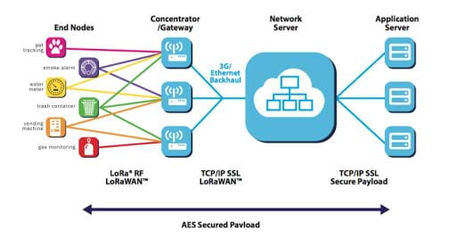

# DFW Pythoneers Talk on LoRa & LoRaWAN

## *Project Architecture:*

LoRa  & LoRaWAN Topology

    source: https://telemetry2u.com/Documentation/lorawan-iot-platform-technical-description

## Eric Livesay:
    Harware:

    Project setup:

## Jack Camier 

*Full Stack Software Engineer, IoT Enthusiast*
https://www.linkedin.com/in/jacques-camier/

    Hardware: SX1262 LoRa HAT Covers 915MHz Frequency Band with Spread Spectrum Modulation

    * https://www.amazon.com/gp/product/B07VS47RQZ/ref=ppx_yo_dt_b_asin_title_o01_s00?ie=UTF8&psc=1

    Project setup: 

        1. Enable Serial Console (UART) on Raspberry Pi

            https://learn.adafruit.com/adafruits-raspberry-pi-lesson-5-using-a-console-cable/enabling-serial-console

        